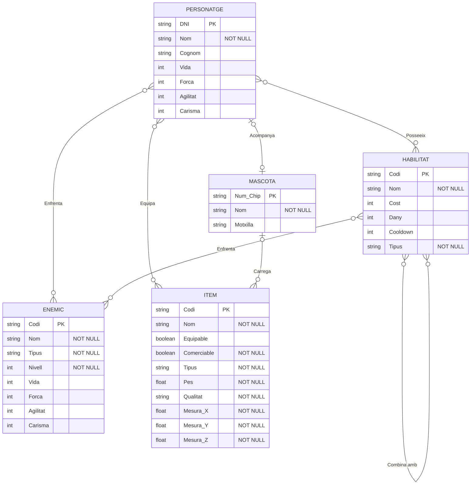

### Iker Burgos Lorente    1rASIX    26/10/2026 

## 1. Diagrama E/R complet

```mermaid
erDiagram
    %% ===== ENTITATS I ATRIBUTS =====
    PERSONATGE {
        string DNI PK
        string Nom "NOT NULL"
        string Cognom
        int Vida
        int Forca
        int Agilitat
        int Carisma
    }

    HABILITAT {
        string Codi PK
        string Nom "NOT NULL"
        int Cost
        int Dany
        int Cooldown
        string Tipus "NOT NULL"
    }

    ENEMIC {
        string Codi PK
        string Nom "NOT NULL"
        string Tipus "NOT NULL"
        int Nivell "NOT NULL"
        int Vida
        int Forca
        int Agilitat
        int Carisma
    }

    MASCOTA {
        string Num_Chip PK
        string Nom "NOT NULL"
        string Motxilla
    }

    ITEM {
        string Codi PK
        string Nom "NOT NULL"
        boolean Equipable
        boolean Comerciable "NOT NULL"
        string Tipus "NOT NULL"
        float Pes "NOT NULL"
        string Qualitat "NOT NULL"
        float Mesura_X "NOT NULL"
        float Mesura_Y "NOT NULL"
        float Mesura_Z "NOT NULL"
    }

    %% ===== RELACIONS =====
    PERSONATGE }o--o{ HABILITAT : Posseeix
    PERSONATGE }o--o{ ENEMIC : Enfrenta
    HABILITAT }o--o{ ENEMIC : Enfrenta
    HABILITAT }o--o{ HABILITAT : "Combina amb"
    PERSONATGE |o--o| MASCOTA : Acompanya
    PERSONATGE }o--o{ ITEM : Equipa
    MASCOTA |o--o{ ITEM : Carrega
```
## Explicació mermaid
